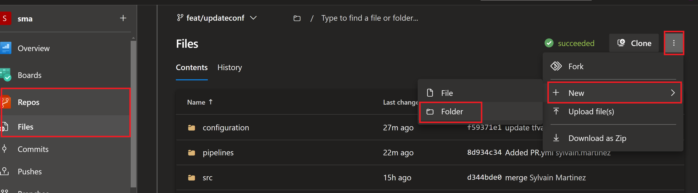

# Create a build pipeline

## Lab overview

In this lab, you will learn how to use Build pipeline.

## Objectives

After you complete this lab, you will be able to:

-   Create a build pipeline using yaml
-   Trigger this pipeline when a Pull Request is created and set it mandatory

## Instructions

### Before you start

- Check your access to the Azure Subscription and Resource Group provided for this training.
- Check your access to the Azure DevOps Organization and project provided for this training.
- Project has branch configuration according to the lab Manage Terraform In Azure Repo Git

### Exercise 1: Create a PR pipeline

In this exercice, we will create a validation pipeline that will check the formating style of Terraform templates.

Select your *terraform-sample* in Azure DevOps portal

Select the *dev* branch

Create a new folder



- New folder name : pipelines
- New file name : PR.yml

Copy the following code in the editor

```yaml
trigger: none

jobs:
- job: Linter
  displayName: Linter
  pool:
    vmImage: ubuntu-20.04
  steps:
  - checkout: self
  - task: PowerShell@2
    inputs:
      targetType: 'inline'
      script: |
        cd ./src/terraform
        terraform fmt -recursive -check -diff
```

Commit this file

> Notice the different sections in this yaml file

Go to the Pipelines blade in Azure DevOps and create a new pipeline


In the Where is your source code step, select **Azure Repo Git**

In the Select a repository step, select **terraform-sample**

In the Configure your pipeline step, select **Existing Azure Pipelines YAML file**

In the select an exising yaml file
- select the **dev** branch
- Fill the path : **/pipelines/PR.yml**

Click on Run to execute the pipeline

> Check the pipeline execution

> This pipeline use terraform fmt to lint terraform source code. If you have errors, fix them and run the pipeline again

Select the Pull Request pipeline in the pipeline blade, and rename it to **PR**


### Exercice 2: Add this pipeline to the policies on main branch

Go to the project settings -> Repositories

Select the terraform-sample project

Select the policies blade

In the Branch Policies, select the main branch

Add a new Build validation


Leave the default options

### Exercice 3: Create a pull request from dev into main

In the Azure Repo blade, select the **terraform-sample** repo

In the repository blade sub-menu, select Pull Requests

Create a new Pull request from **dev** into **main**

> Notice the build validation is triggered

### Exercice 4: Produce an artefact when change are merged on the main branch

In this exercice we will add another pipeline definition to produce an artefact when new code is merged on the main branch

Select your *terraform-sample* in Azure DevOps portal

Select the *dev* branch

Create a new file

- New file name : build.yml

Copy the following code in the editor

```yaml
trigger:
  branches:
    include:
    - main

jobs:
- job: Artefact
  displayName: Upload artefact
  pool:
    vmImage: ubuntu-20.04
  steps:
  - checkout: self
  - task: PowerShell@2
    inputs:
      targetType: 'inline'
      script: |
        Copy-Item -Path ./src -Destination $(Build.ArtifactStagingDirectory)/terraform -Recurse
        Copy-Item -Path ./configuration -Destination $(Build.ArtifactStagingDirectory)/terraform -Recurse
  - task: PublishBuildArtifacts@1
    inputs:
      PathtoPublish: '$(Build.ArtifactStagingDirectory)/terraform'
      ArtifactName: 'terraform'
      publishLocation: 'Container'
```

> This pipeline create an artefact containing both src and configuration folder

> This files are required to perform a deployment on an environment

Go to the Pipelines blade in Azure DevOps and create a new pipeline


In the Where is your source code step, select **Azure Repo Git**

In the Select a repository step, select **terraform-sample**

In the Configure your pipeline step, select **Existing Azure Pipelines YAML file**

In the select an exising yaml file
- select the **dev** branch
- Fill the path : **/pipelines/build.yml**

Click on Run to execute the pipeline

In the pipeline blade, ensure the pipeline has run and artefact has been produced


> Notice the content of the produced artefact


### Exercice 5: Create a pull request from dev into main

In the Azure Repo blade, select the **terraform-sample** repo

In the repository blade sub-menu, select Pull Requests

Create a new Pull request from **dev** into **main**

> Notice that the build pipeline has been triggered and artefact is published

### Exercice 6: Rename the build pipeline

We will later use this pipeline as source for another one. To clearly identity this resource pipeline, a name might be given.

Select the build pipeline in the pipeline blade, and rename it to **build**


