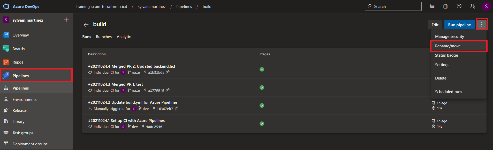
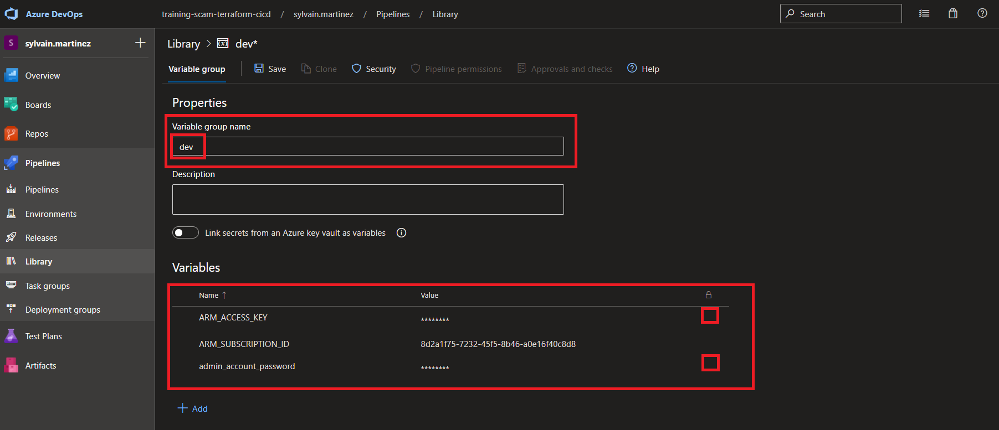
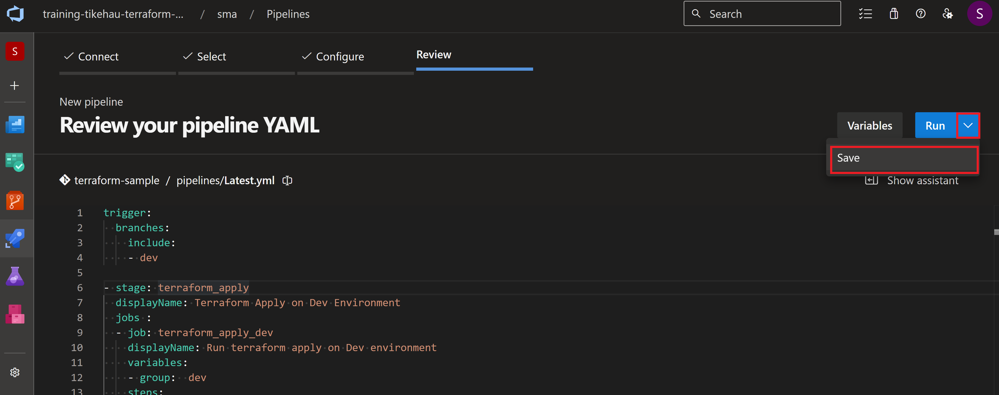

# Create a build pipeline

## Lab overview

In this lab, you will learn how to use Build pipeline.

## Objectives

After you complete this lab, you will be able to:

-   Create a build pipeline using yaml
-   Trigger this pipeline when a Pull Request is created and set it mandatory
-   Deploy the Dev environment

## Instructions

### Before you start

- Check your access to the Azure Subscription and Resource Group provided for this training.
- Check your access to the Azure DevOps Organization and project provided for this training.
- Project has branch configuration according to the lab Manage Terraform In Azure Repo Git

### Exercise 1: Create a PR pipeline

In this exercice, we will create a validation pipeline that will check the formating style of Terraform templates.

Select your *terraform-sample* in Azure DevOps portal

Select the *feat/updateconf* branch

Create a new folder


- New folder name : pipelines
- New file name : PR.yml

Copy the following code in the editor

```yaml
trigger: none

jobs:
- job: Linter
  displayName: Linter
  pool:
    vmImage: ubuntu-20.04
  steps:
  - checkout: self
  - task: PowerShell@2
    inputs:
      targetType: 'inline'
      script: |
        cd ./src/terraform
        terraform fmt -recursive -check -diff
```

Commit this file

> Notice the different sections in this yaml file

Go to the Pipelines blade in Azure DevOps and create a new pipeline


In the Where is your source code step, select **Azure Repo Git**

In the Select a repository step, select **terraform-sample**

In the Configure your pipeline step, select **Existing Azure Pipelines YAML file**

In the select an exising yaml file
- select the **feat/updateconf** branch
- Fill the path : **/pipelines/PR.yml**

Click on Run to execute the pipeline

> Check the pipeline execution

> This pipeline use terraform fmt to lint terraform source code. If you have errors, fix them and run the pipeline again

Select the Pull Request pipeline in the pipeline blade, and rename it to **PR**



### Exercice 2: Add this pipeline to the policies on dev branch

Go to the project settings -> Repositories

Select the terraform-sample project

Select the policies blade

In the Branch Policies, select the dev branch

Add a new Build validation


Leave the default options

### Exercice 3: Create a pull request from feat/updateconf into dev

In the Azure Repo blade, select the **terraform-sample** repo

In the repository blade sub-menu, select Pull Requests

Create a new Pull Request


In the branch selection, select from **feat/updateconf** into **dev** and set its title to *update config*


Click on create at the bottom of the page

> Notice the build validation is triggered

Approve this Pull Request and complete it. You can leave the default selection.

### Exercice 4: Create Dev library

In this exercice we will create a library for the dev environment.

A library might be used to store variables and secrets for an environment.

> An environment configuration might be done in multiple libraries. All of this libraries should follow the environment segregation principle.

In the pipeline blade, Select Library and add a variable group


In the *Properties*, set the *Variable group name* to **dev**

in the *Variables*, add 3 items:

- **ARM_SUBSCRIPTION_ID**: The subscription Id where resources must be deployed. Use the training subscription ID. You can get it from the Azure Portal
- **admin_account_password**: The Admin Account password for the database to be created. Must be Azure compliant (if you're not inspired, P@ssword01! is fine)

Set the **admin_account_password** as secret



### Exercice 5: Add validation and plan on Pull Request

Create a new branch using the Azure DevOps Portal


Select *dev* in the *based on* field, and name this branch *feat/planpr*

In the portal, update the content of the *PR.yml* file using the following yaml

```yaml
trigger: none

stages:
- stage: Linter
  displayName: Linter
  jobs:
  - job: Linter
    displayName: Linter
    pool:
      vmImage: ubuntu-20.04
    steps:
    - checkout: self
    - task: PowerShell@2
      inputs:
        targetType: 'inline'
        script: |
          cd ./src/terraform
          terraform fmt -recursive -check -diff

- stage: terraform_plan
  displayName: Terraform plan on Dev Environment
  dependsOn: Linter
  jobs :
  - job: terraform_plan_dev
    displayName: Run terraform plan on Dev environment
    variables:
    - group:  dev
    steps:
    - checkout: self

    - task: AzureCLI@2
      env:
        TF_VAR_admin_account_password : $(admin_account_password)
      displayName: Run terraform plan on Dev environment
      inputs:
        azureSubscription: ARM Service Connection DEV
        scriptType: 'pscore'
        scriptLocation: 'inlineScript'
        addSpnToEnvironment: true
        inlineScript: |
            cd ./src/terraform
            $env:ARM_CLIENT_ID=$env:servicePrincipalId
            $env:ARM_CLIENT_SECRET=$env:servicePrincipalKey
            $env:ARM_TENANT_ID=$env:tenantId
            terraform init -upgrade -backend-config='../../configuration/dev/backend.hcl'
            terraform plan -var-file='../../configuration/dev/var.tfvars' -input=false
```

> Notice the different sections of this pipelines

Commit this file to the *feat/planpr* branch

Create a new Pull Request from the branch *feat/planpr* to the branch *dev*.

> The build validation is triggered

Click on  *PR Build in progress*

> You must grant the authorizations for the PR pipeline to access the Service Connection and the library. It only happens the first time a pipeline is trying to access resources

Grant the required permissions, clicking on *View* then *Permit* for both resources.

Once the stage is executed, you can see the generated plan in the pipeline logs


### Exercice 7: Deploy on Dev environment

We will now add a new pipeline to deploy the Dev environment once a Pull Request is merged on the *dev* branch.

In the portal, using the *feat/planpr*, add a new file in the pipelines folder nammed *latest.yaml*

```yaml
trigger:
  branches:
    include:
    - dev

stages:
- stage: terraform_apply
  displayName: Terraform Apply on Dev Environment
  jobs :
  - job: terraform_apply_dev
    displayName: Run terraform apply on Dev environment
    variables:
    - group:  dev
    steps:
    - checkout: self

    - task: AzureCLI@2
      env:
        TF_VAR_admin_account_password : $(admin_account_password)
      displayName: Run terraform apply on Dev environment
      inputs:
        azureSubscription: ARM Service Connection DEV
        scriptType: 'pscore'
        scriptLocation: 'inlineScript'
        addSpnToEnvironment: true
        inlineScript: |
            cd ./src/terraform
            $env:ARM_CLIENT_ID=$env:servicePrincipalId
            $env:ARM_CLIENT_SECRET=$env:servicePrincipalKey
            $env:ARM_TENANT_ID=$env:tenantId
            terraform init -upgrade -backend-config='../../configuration/dev/backend.hcl'
            terraform apply -var-file='../../configuration/dev/var.tfvars' -input=false -auto-approve
```

Commit this file to the *feat/planpr* branch

> Adding this file will update the Pull Request, and a new PR build validation will be executed.

Create a new Pipeline in Azure DevOps (like you did for the PR pipeline) using this file.

Do not run this pipeline right now, only save it.

Rename this pipeline to *latest*



Complete and merge the opened Pull Request.

Once its merged, the latest pipeline is triggered.

In the pipeline blade, find the running latest pipeline, and grant the required permissions (like for the PR pipeline).

Once the pipeline is executed, check the created resources in the Azure Portal

### Exercice 8: Produce an artefact when change are merged on the main branch

In this exercice we will add another pipeline definition to produce an artefact when new code is merged on the main branch

Select your *terraform-sample* in Azure DevOps portal

Create a new branch, based on the *dev* branch, and name it *feat/buildartefact*

Create a new file in the pipeline repository named *build.yml*

Copy the following code in the editor

```yaml
trigger:
  branches:
    include:
    - main

jobs:
- job: Artefact
  displayName: Upload artefact
  pool:
    vmImage: ubuntu-20.04
  steps:
  - checkout: self
  - task: PowerShell@2
    inputs:
      targetType: 'inline'
      script: |
        Copy-Item -Path ./src -Destination $(Build.ArtifactStagingDirectory)/terraform -Recurse
        Copy-Item -Path ./configuration -Destination $(Build.ArtifactStagingDirectory)/terraform -Recurse
  - task: PublishBuildArtifacts@1
    inputs:
      PathtoPublish: '$(Build.ArtifactStagingDirectory)/terraform'
      ArtifactName: 'terraform'
      publishLocation: 'Container'
```

> This pipeline create an artefact containing both src and configuration folder

> This files are required to perform a deployment on an environment

Go to the Pipelines blade in Azure DevOps and create a new pipeline


In the Where is your source code step, select **Azure Repo Git**

In the Select a repository step, select **terraform-sample**

In the Configure your pipeline step, select **Existing Azure Pipelines YAML file**

In the select an exising yaml file
- select the **feat/buildartefact** branch
- Fill the path : **/pipelines/build.yml**

Click on Save (do not run this pipeline right now)

Rename this pipeline as *build*.

Create a Pull Request and merge this branch in the *dev* branch.

### Exercice 9: Create a pull request from dev into main

In the Azure Repo blade, select the **terraform-sample** repo

In the repository blade sub-menu, select Pull Requests

Create a new Pull request from **dev** into **main**

When merging this Pull Request, ensure that the checkbox *Delete dev after merging is not checked*.

> Notice that the build pipeline has been triggered and artefact is published

In the pipeline blade, ensure the build pipeline has run and artefact has been produced


> Notice the content of the produced artefact


