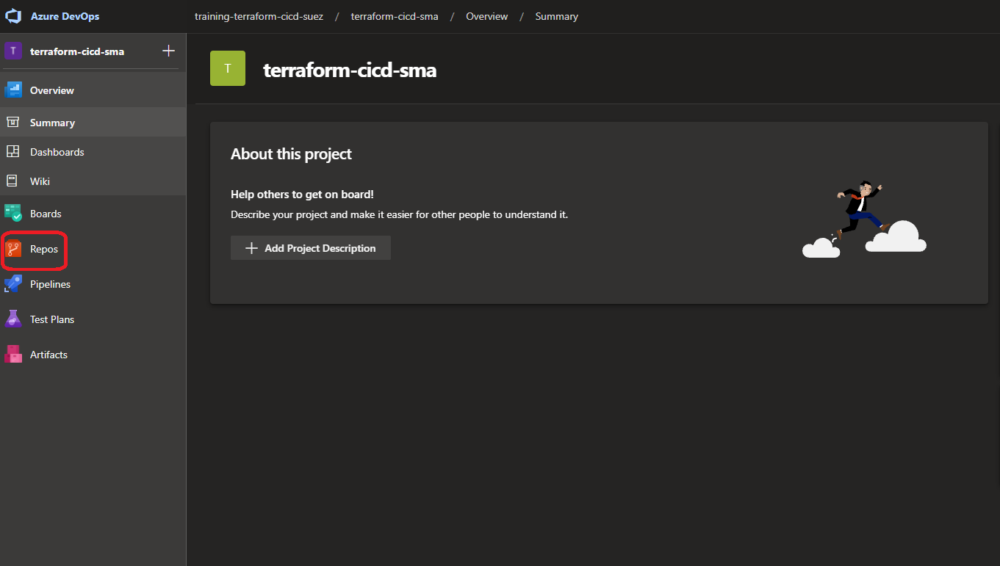
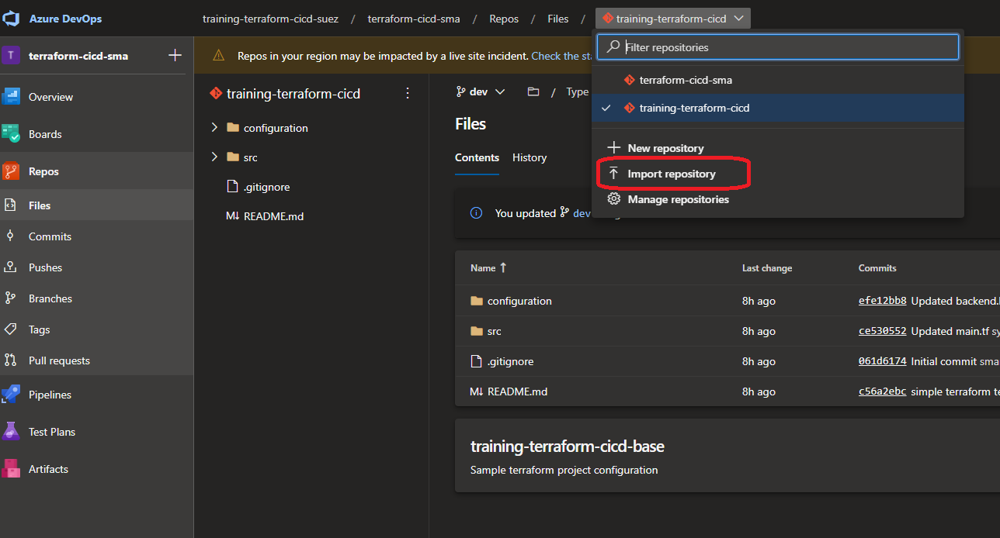
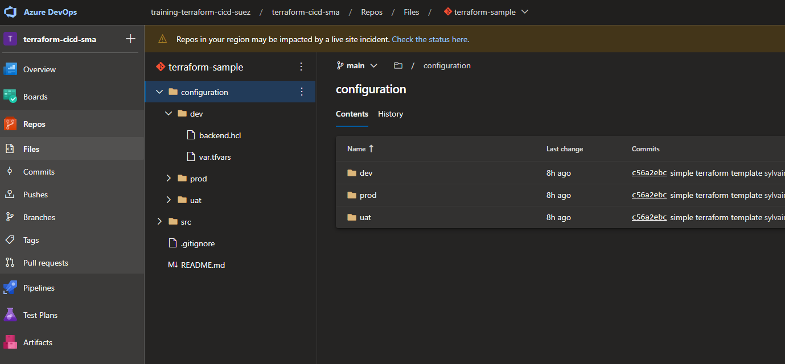
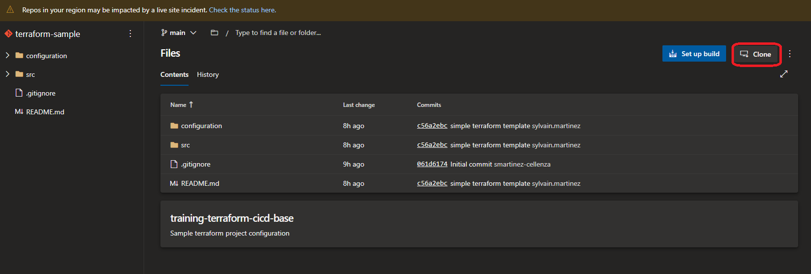

# Manage Terraform In Azure Repo Git

## Lab overview

In this lab, you will learn how to use Source Control for Terraform templates.

## Objectives

After you complete this lab, you will be able to:

-   Create an Azure Git repository
-   Use Source Control for Terraform templates

## Instructions

### Before you start

- Check your access to the Azure Subscription and Resource Group provided for this training.
- Check your access to the Azure DevOps Organization and project provided for this training.
- Using the Azure Portal, create a Storage Account with a **tfstates** container. We are going to use this container as backend for the the tfstate file.


### Exercise 1: Import a Git Repository

We are going to use an existing repository and import it in Azure DevOps.

In the Azure Portal, go to the *Repos* blade



Select the Repository dropdown list and and select Import Repository



In the Import blade:

- Leave the Repository type to Git
- For the the Clone URL, use **https://github.com/smartinez-cellenza/training-terraform-cicd-base.git**
- Name your repository **terraform-sample**


The import will start and create a new Azure DevOps Git repository


The repository is imported and ready to use



### Exercise 2: Create a branch

In this exercice, we are going to create a dev branch

#### Clone Repository and create branch

Get the clone URL of your repository



Run the following command to clone the repository

```powershell
mkdir training_terraform_cicd
cd training_terraform_cicd
git clone the_repository_clone_url
```

> If it's the first time you use this Azure DevOps Organization, provide authentication informations

Go to the cloned Repository folder

```powershell
cd ./terraform-sample/
```

Create a new local branch, nammed dev

```powershell
git checkout -b dev
```

Push this local branch to Azure DevOps

```powershell
git push --set-upstream origin dev
```

#### Update backends configuration and variables

Create a new local branch from the *dev* branch, nammed *feat/updateconf*

```powershell
git status
# Ensure you are on the dev branch.
git checkout -b feat/updateconf
```

In the configuration folder, update the **backend.hcl** file for **each environment**. Update *resource_group_name* and *storage_account_name* to match the Storage Account you created earlier.

> We will use the same Storage Account and container for all environments. Only the tfstate file name will be different.

> This is a lab configuration. In real environments, you might want to use a dedicated storage for each environment.

Add this files for the next commit

```powershell
git add .
```

Create a new commit

```powershell
git commit -m "update backend configuration"
```

In the configuration folder, update the **var.tfvars** file for **each environment**.
- **resource_group_name** : The name of the Resource Group you are using for this training
- **admin_account_login** : We are going to deploy an Azure SQL Database Server. This variable will be used to set the Administrator account login
- **project_name** : The name of the project. It will be used with the environment variable to build the SQL Server name.

Add this files for the next commit

```powershell
git add .
```

Create a new commit

```powershell
git commit -m "update tfvars"
```

push this branch

```powershell
git push --set-upstream origin feat/updateconf
```

### Exercise 3: Protect dev and main branch

Go to the project settings -> Repositories

Select the terraform-sample project

Select the policies blade

In the Branch Policies, select the **main** branch

Activate the option **Require a minimum number of reviewers**, set the Minimum number of reviewvers to 1 and Allow requestors to approve their own changes.

> This will prevent direct commit to the main branch, and only allow Pull Request

> This configuration is not suitable for a real world project, but it allows you to complete pull request for this lab

Apply the same configuration to the **dev** branch