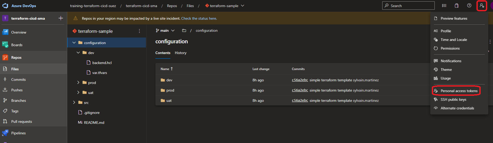

# Manage Terraform In Azure Repo Git

## Lab overview

In this lab, you will learn how to use Source Control for Terraform templates.

## Objectives

After you complete this lab, you will be able to:

-   Create an Azure Git repository
-   Use Source Control for Terraform templates

## Instructions

### Before you start

- Check your access to the Azure Subscription and Resource Group provided for this training.
- Check your access to the Azure DevOps Organization and project provided for this training.
- Using the Azure Portal, create a Storage Account with a **tfstates** container. We are going to use this container as backend for the the tfstate file.


### Exercise 1: Import a Git Repository

We are going to use an existing repository and import it in Azure DevOps.

In the Azure Portal, go to the *Repos* blade


Select the Repository dropdown list and and select Import Repository


In the Import blade:

- Leave the Repository type to Git
- For the the Clone URL, use **https://github.com/smartinez-cellenza/training-terraform-cicd-base.git**
- Name your repository **terraform-sample**


The import will start and create a new Azure DevOps Git repository


The repository is imported and ready to use


### Exercise 2: Create a branch

In this exercice, we are going to create a dev branch

#### Generate a PAT (Personal Access Token)

In the Azure DevOps portal, generate a new Personal Access Token



Click on *New Token*


- Name : training
- Scope : Code -> Read & write

Click on Create and copy the generated Token

> We're going to use this token to clone the repository

#### Clone Repository and create branch

Get the clone URL of your repository


In the Azure Portal, open a Cloud Shell session

Run the following command to clone the repository

```powershell
git clone the_repository_url_just_get
```

When prompted, copy the Personal Access Token

Go to the cloned Repository folder

```powershell
cd ./terraform-sample/
```

Create a new local branch, nammed dev

```powershell
git checkout -b dev
```

In the configuration folder, update the **backend.hcl** file for each environment. Update *resource_group_name* and *storage_account_name* to match the Storage Account you created earlier.

Add this file for the next commit

```powershell
git add .
```

Create a new commit

```powershell
git commit -m "update backend configuration"
```

push this branch

```powershell
git push --set-upstream origin dev
```

When prompted, copy the Personal Access Token

### Exercise 3: Protect main branch

Go to the project settings -> Repositories

Select the terraform-sample project

Select the policies blade

In the Branch Policies, select the main branch

Activate the option **Require a minimum number of reviewers**, set the Minimum number of reviewvers to 1 and Allow requestors to approve their own changes.

> This will prevent direct commit to the main branch, and only allow Pull Request

> This configuration is not suitable for a real world project, but it allows you to complete pull request for this lab
