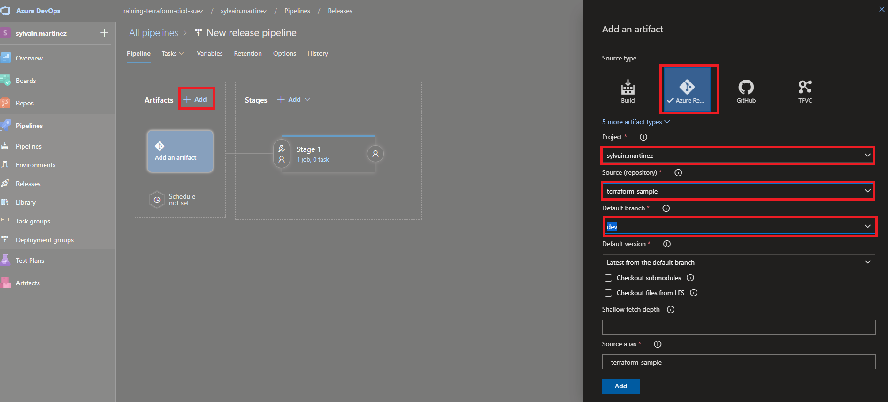
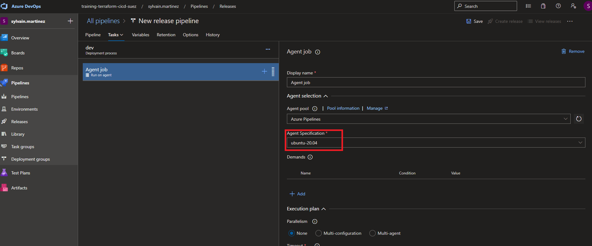
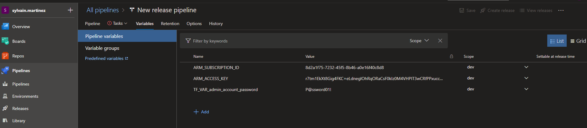
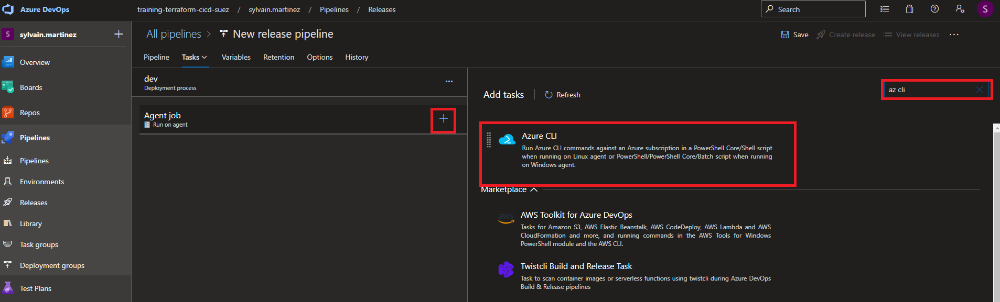

# Create a release pipeline

## Lab overview

In this lab, you will learn how to use release pipeline.

## Objectives

After you complete this lab, you will be able to:

-   Create a release pipeline using yaml
-   Deploy Terraform template using CI/CD

## Instructions

### Before you start

- Check your access to the Azure Subscription and Resource Group provided for this training.
- Check your access to the Azure DevOps Organization and project provided for this training.
- Project has branch configuration according to the lab Manage Terraform In Azure Repo Git and backend configuration is done to match your Storage Account

### Exercise 1: Create Environments

In this exercice, we will create the 3 environments (in Azure DevOps) to match the 3 configuration we have.

In the Azure DevOps portal, go the pipelines blade, and selected Environments.

Click on Create environment.

In the New environment window, set the information on the environment

- **Name**: dev *(keep it lowercase)*
- **Description**: Dev environment

Repeat this step for the **uat** and **prod** environment

### Exercice 2: Set approbation

In this exercice we will configure approbation for environment deployment for **uat** and **prod** environments.

Our workflow will be te deploy to dev without confirmation, and require a manual approvers for the 2 others environment.

In the Azure DevOps portal, go the pipelines blade, and selected Environments.

Select the **uat** environment.

In the options menu, select **Approval and checks**

Select **Aprovals**

Add your self in the **Approvers** list and click on **Create**

> Notice the others checks available, based on Branch or Business Hours

Repeat this step for the **prod** environment

### Exercice 3: Create libraries

In this exercice we will create a library for each of the environment.

A library might be used to store variables and secrets for an environment.

> An environment configuration might be done in multiple libraries. All of this libraries should follow the environment segregation principle.

In the pipeline blade, Select Library and add a variable group

In the *Properties*, set the *Variable group name* to **dev**

in the *Variables*, add 3 items:

- **ARM_ACCESS_KEY**: On of the Storage Account Access key. Since we will use a Service Principal to authenticate, this information is required. You can get one from the Storage Account Access keys blade in the Azure Portal.
- **ARM_SUBSCRIPTION_ID**: The subscription Id where resources must be deployed. Use the training subscription ID. You can get it from the Azure Portal
- **admin_account_password**: The Admin Account password for the database to be created. Must be Azure compliant (if you're not inspired, P@ssword01! is fine)

For **ARM_ACCESS_KEY** and **admin_account_password**, set them as secret

Repeat the same operation for **uat** and **prod** environment. **ARM_ACCESS_KEY** and **ARM_SUBSCRIPTION_ID** won't change in our case (we will always target the same subscription)

In the Azure portal, select your project

Select your project

In the Pipelines blade, select Release

Click on **New Pipeline**

Select **Start with an empty job**

In the stage window, rename the stage **dev** and close the window

Click on **Add an artifact

- Source Type : **Azure Repository**
- Project : **your project**
- Default branch : **dev**

In the **dev** change the agent specification to use ubuntu-20.04

In the variable tab, create variables

- ARM_SUBSCRIPTION_ID : Id of the provided subscription
- ARM_ACCESS_KEY : An access key of the backend Storage Account
- TF_VAR_admin_account_password : Admin account password of the DB

Add a new Azure CLI task

Configure this task

Select **Approvals**

In the Approver list, add your user

> All Deployment job regarding this environment should now be validated

### Exercice 2: Add this pipeline to the policies on main branch

Go to the project settings -> Repositories

Select the terraform-sample project

Select the policies blade

In the Branch Policies, select the main branch

Add a new Build validation

Leave the default options

### Exercice 3: Create a pull request from dev into main

In the Azure Repo blade, select the **terraform-sample** repo

In the repository blade sub-menu, select Pull Requests

Create a new Pull request from **dev** into **main**

> Notice the build validation is triggered
