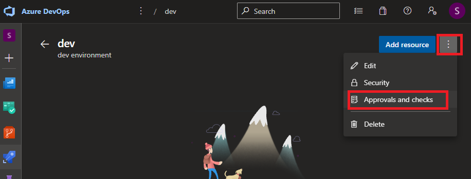

# Create a release pipeline

## Lab overview

In this lab, you will learn how to use release pipeline.

## Objectives

After you complete this lab, you will be able to:

-   Create a release pipeline using yaml
-   Deploy Terraform template using CI/CD

## Instructions

### Before you start

- Check your access to the Azure Subscription and Resource Group provided for this training.
- Check your access to the Azure DevOps Organization and project provided for this training.
- Project has branch configuration according to the lab Manage Terraform In Azure Repo Git

### Exercise 1: Create Environment

In the Azure portal, select your project

Select your project

In the Pipelines blade, select Environments

Create a new Environment

- Name : **dev**
- Description : **dev environment**

Select **Approvals**

In the Approver list, add your user

> All Deployment job regarding this environment should now be validated

### Exercice 2: Add this pipeline to the policies on main branch

Go to the project settings -> Repositories

Select the terraform-sample project

Select the policies blade

In the Branch Policies, select the main branch

Add a new Build validation

Leave the default options

### Exercice 2: Create a pull request from dev into main

In the Azure Repo blade, select the **terraform-sample** repo

In the repository blade sub-menu, select Pull Requests

Create a new Pull request from **dev** into **main**

> Notice the build validation is triggered