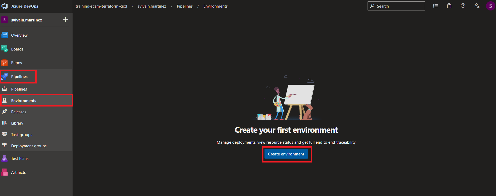
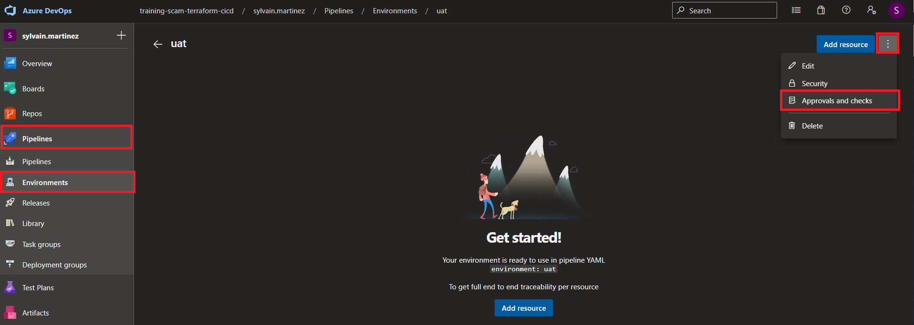
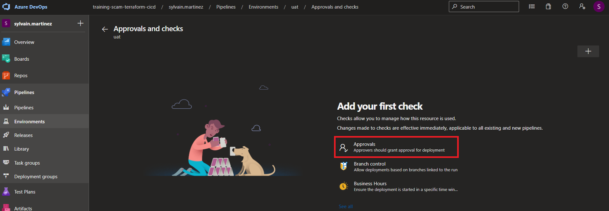
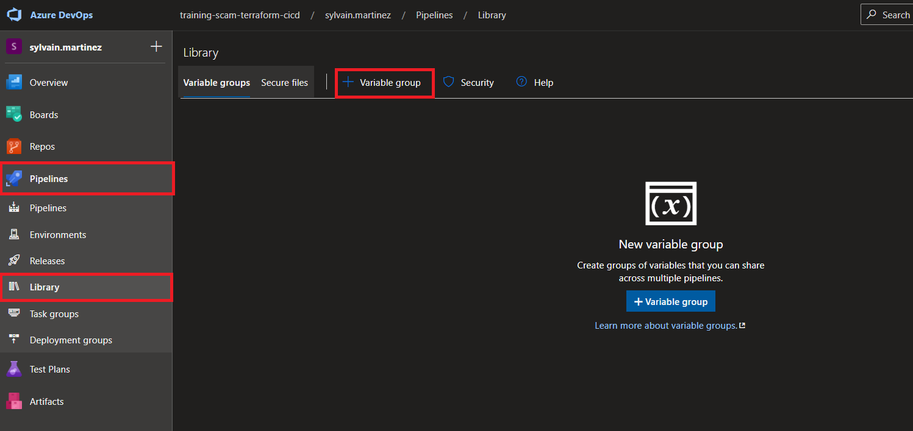
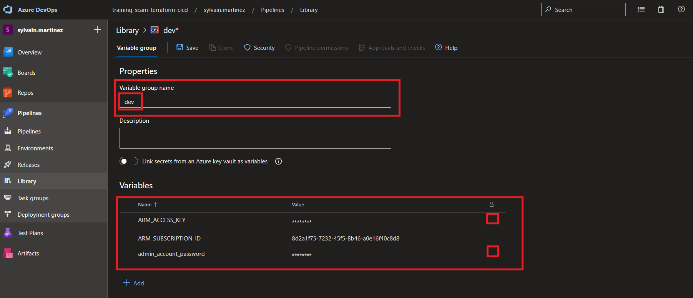
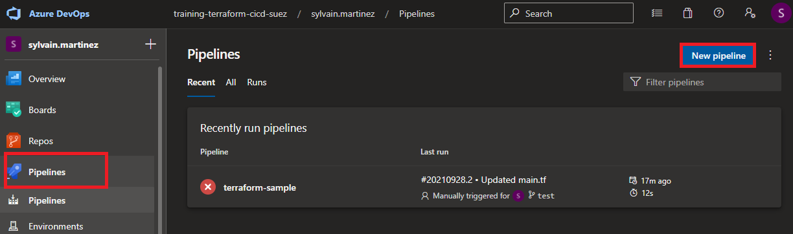
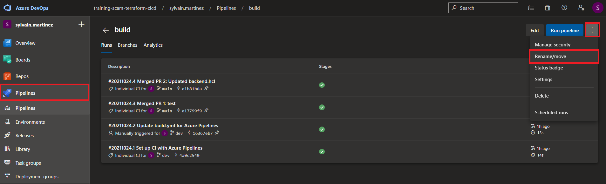
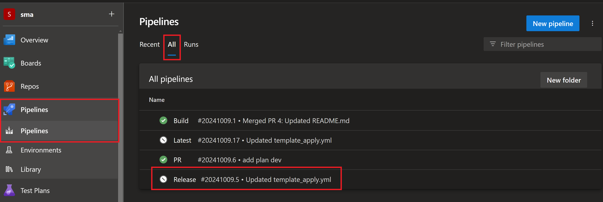
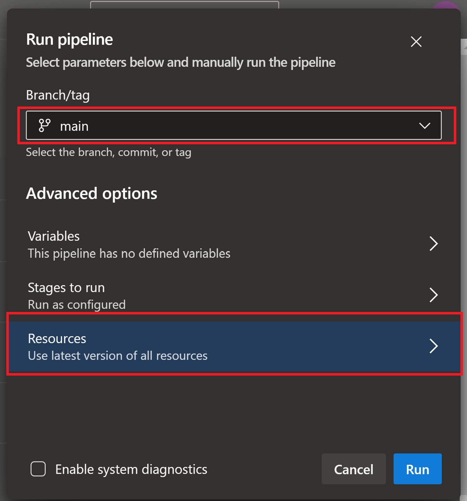

# Create a release pipeline

## Lab overview

In this lab, you will learn how to use release pipeline.

## Objectives

After you complete this lab, you will be able to:

-   Create a release pipeline using yaml
-   Deploy Terraform template using CI/CD

## Instructions

### Before you start

- Check your access to the Azure Subscription and Resource Group provided for this training.
- Check your access to the Azure DevOps Organization and project provided for this training.
- Project has branch configuration according to the lab Manage Terraform In Azure Repo Git and backend configuration is done to match your Storage Account

### Exercise 1: Create Environments

In this exercice, we will create the 2 environments (in Azure DevOps).

In the Azure DevOps portal, go the pipelines blade, and selected Environments.

Click on Create environment.



In the New environment window, set the information on the environment

- **Name**: uat *(keep it lowercase)*
- **Description**: UAT environment

Repeat this step for the **prod** environment

### Exercice 2: Set approbation

In this exercice we will configure approbation for environment deployment for **uat** and **prod** environments.

An approbation is required for this environment. This approbation should only be given once the plan has been reviewed and validated.

In the Azure DevOps portal, go the pipelines blade, and selected Environments.

Select the **uat** environment.

In the options menu, select **Approval and checks**



Select **Aprovals**



Add your self in the **Approvers** list and click on **Create**

> Notice the others checks available, based on Branch or Business Hours

Repeat this step for the **prod** environment

### Exercice 3: Create libraries

In this exercice we will create a library for uat and prod environments.

A library might be used to store variables and secrets for an environment.

> An environment configuration might be done in multiple libraries. All of this libraries should follow the environment segregation principle.

In the pipeline blade, Select Library and add a variable group



In the *Properties*, set the *Variable group name* to **uat**

in the *Variables*, add 3 items:

- **ARM_SUBSCRIPTION_ID**: The subscription Id where resources must be deployed. Use the training subscription ID. You can get it from the Azure Portal
- **admin_account_password**: The Admin Account password for the database to be created. Must be Azure compliant (if you're not inspired, P@ssword01! is fine)


Set **admin_account_password** as secret



Repeat the same operation for **prod** environment. **ARM_SUBSCRIPTION_ID** won't change in our case (we will always target the same subscription)

### Exercice 4: Create Release pipeline

In the exercice, we will create the Release pipeline.

It will use
- The artefact produced by the build pipeline
- The libraries we created
- The environments we created

Select your *terraform-sample* in Azure DevOps portal

Create a new branch from the *dev* branch and name it *feat/release*

Create a new file in the pipeline folder, and name it *template_plan.yml*

Copy the following code in the editor

```yaml
parameters:
- name: stageName
- name: environment
- name: dependsOn
  type: object
  default: []

stages:
- stage: ${{ parameters.stageName }}
  displayName: Run terraform plan on ${{ parameters.environment }} environment
  dependsOn: ${{ parameters.dependsOn }}
  jobs :
  - job: terraform_plan_${{ parameters.environment }}
    displayName: Run terraform plan on ${{ parameters.environment }} environment
    variables:
    - group:  ${{ parameters.environment }}
    steps:
    - download: build
    - task: AzureCLI@2
      env:
        TF_VAR_admin_account_password : $(admin_account_password)
      displayName: Run terraform plan on ${{ parameters.environment }} environment
      inputs:
        azureSubscription: 'ARM Service Connection ${{ upper(parameters.environment) }}'
        scriptType: 'pscore'
        scriptLocation: 'inlineScript'
        addSpnToEnvironment: true
        inlineScript: |
            cd $(PIPELINE.WORKSPACE)/Build/terraform/terraform
            $env:ARM_CLIENT_ID=$env:servicePrincipalId
            $env:ARM_CLIENT_SECRET=$env:servicePrincipalKey
            $env:ARM_TENANT_ID=$env:tenantId
            terraform init -backend-config='../configuration/${{ parameters.environment }}/backend.hcl'
            terraform plan -var-file='../configuration/${{ parameters.environment }}/var.tfvars' -input=false
```

> Notice the different sections

> Notice the parameters and the syntax for interpolation

> This file is a template we are going to use for both uat and prod environments

Commit this file to the *feat/release* branch

Create a new file in the pipeline folder, and name it *template_apply.yml*

Copy the following code in the editor

```yaml
parameters:
- name: stageName
- name: environment
- name: dependsOn
  type: object
  default: []

stages:
- stage: ${{ parameters.stageName }}
  displayName: Run terraform apply on ${{ parameters.environment }} environment
  dependsOn: ${{ parameters.dependsOn }}
  jobs :
  - deployment: terraform_apply_${{ parameters.environment }}
    displayName: Run terraform apply on ${{ parameters.environment }} environment
    environment: ${{ parameters.environment }}
    variables:
    - group:  ${{ parameters.environment }}
    strategy:
      runOnce:
        deploy:
          steps:
          - checkout: self
          - task: AzureCLI@2
            env:
              TF_VAR_admin_account_password : $(admin_account_password)
            displayName: Run terraform apply on ${{ parameters.environment }} environment
            inputs:
              azureSubscription: 'ARM Service Connection ${{ upper(parameters.environment) }}'
              scriptType: 'pscore'
              scriptLocation: 'inlineScript'
              addSpnToEnvironment: true
              inlineScript: |
                  cd $(PIPELINE.WORKSPACE)/Build/terraform/terraform
                  $env:ARM_CLIENT_ID=$env:servicePrincipalId
                  $env:ARM_CLIENT_SECRET=$env:servicePrincipalKey
                  $env:ARM_TENANT_ID=$env:tenantId
                  terraform init -backend-config='../configuration/${{ parameters.environment }}/backend.hcl'
                  terraform apply -var-file='../configuration/${{ parameters.environment }}/var.tfvars' -input=false -auto-approve
```

> Notice the deployment job

> This file is a template we are going to use for both uat and prod environments

Create a new file in the pipeline folder, and name it *template_apply.yml*

Copy the following code in the editor

```yml
trigger: none

resources:
  pipelines:
    - pipeline: Build
      source: Build

stages:
  - template: template_plan.yml
    parameters:
      stageName: terraform_plan_uat
      environment: uat

  - template: template_apply.yml
    parameters:
      stageName: terraform_apply_uat
      environment: uat
      dependsOn: ["terraform_plan_uat"]

  - template: template_plan.yml
    parameters:
      stageName: terraform_plan_prod
      environment: prod
      dependsOn: ["terraform_apply_uat"]

  - template: template_apply.yml
    parameters:
      stageName: terraform_apply_prod
      environment: prod
      dependsOn: ["terraform_plan_prod"]

```

> Notice the different sections

> This template is the 'main' template, the one we are going to use create our pipeline

Go to the Pipelines blade in Azure DevOps and create a new pipeline



In the Where is your source code step, select **Azure Repo Git**

In the Select a repository step, select **terraform-sample**

In the Configure your pipeline step, select **Existing Azure Pipelines YAML file**

In the select an exising yaml file
- select the **feat/realase** branch
- Fill the path : **/pipelines/release.yml**

Click on Save (do not trigger this pipeline right now)

Select the release pipeline in the pipeline blade, and rename it to **Release**

Merge the branch *feat/realase* into *dev* then merge *dev* into *main*.



### Exercice 5: Trigger the release pipeline

In the exercice, we will trigger the release pipeline to deploy uat environment then prod.

It will use
- The artefact produced by the build pipeline
- The libraries we created
- The environments we created

A Service Connection has been created and shared in your project. It contains the information on the Service Principal.

Select your *terraform-sample* in Azure DevOps portal

In the pipeline blade, select the Release pipeline



Click on Run Pipeline



> Notice that you can select the Resources blade the version of the artefact to deploy. Default is to use the latest generated one.

Click on Run

The pipeline execution starts. Grant the required authorizations to execute the plan on uat environment stage. Once this stage is finished, grant the authorizations for the apply on uat environment stage.

> Even when the pipeline is granted with the authorizations, the stage won't be executed. It requires an approbation, configured in the environment

Approve the deployement.

Once the stage is finished, check for the resources in the Azure Portal.
